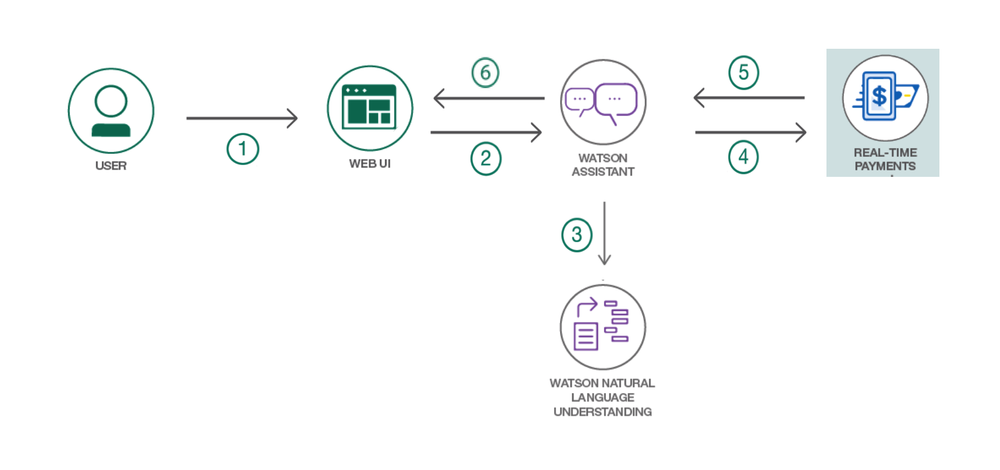
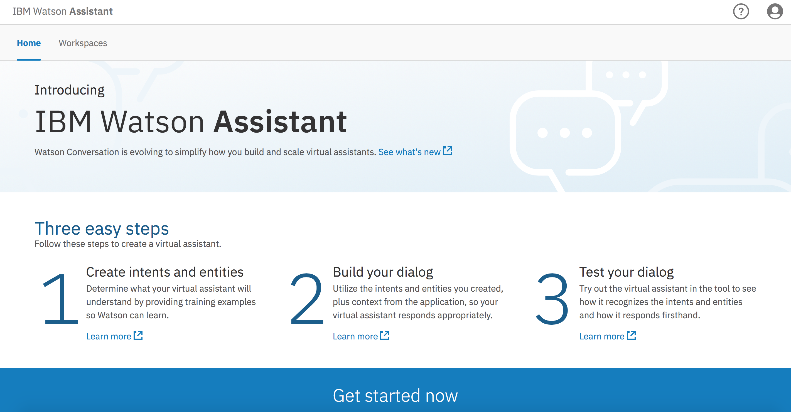
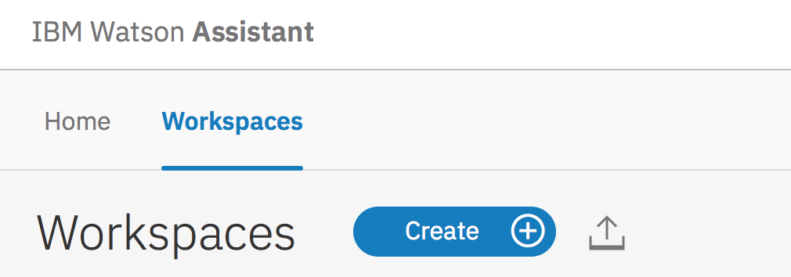
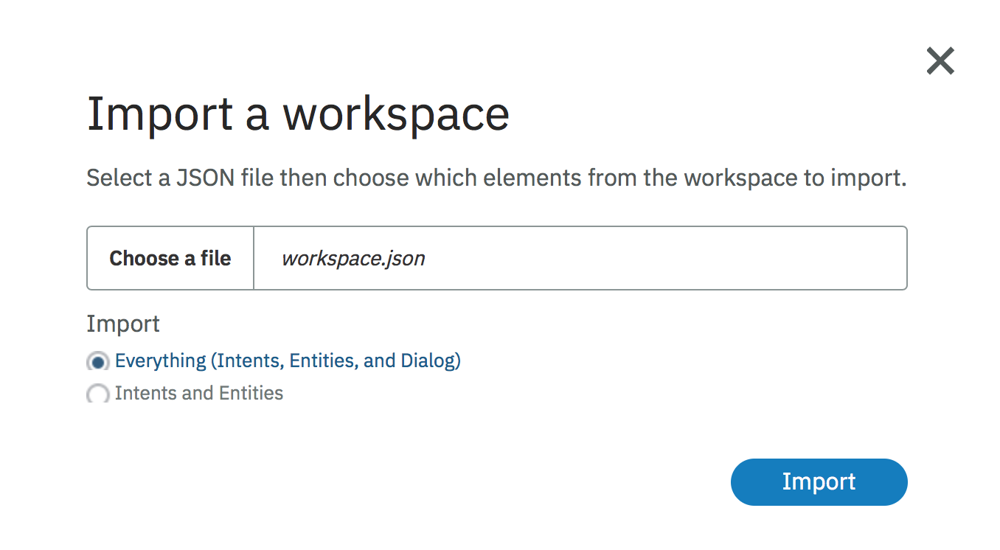

# Create a chatbot for real-time payments

In this code pattern, we will use IBM Cloud services to create a Node.js web application featuring a chatbot to send payments and provide account information. The Real-Time Payments service is used to manage user accounts and recipients, and to initiate payments. The Watson Assistant service will be used to create a dialog for the chatbot, which will process user's requests. The Natural Language Understanding service will enhance the chatbot capabilities to identify entities.

When the reader has completed this pattern, they will understand how to:
  * Create a chatbot dialog with Watson Assistant and Natural Language Understanding
  * Setup Real-Time Payments service to manage user's accounts and recipients, and process payments
  * Integrate chatbot with Real-Time Payments service to process payments and provide user information


# Architecture



1. The user accesses the chatbot through the real-time payments web application
2. Watson Assistant takes in natural language input and breaks and maps it to intents and entities that it has been trained for
3. User input is processed with Natural Language Understanding. The context is enriched with detected entities and keywords
4. Real-Time Payments processes the user's request such as sending payments, providing account data, or information on transactions
5. Watson Assistant uses the data/response from the Real-Time Payments service to provide an informative response
6. The response is delivered to the user through the chatbot in the web application


## Prerequisite
* <b>[IBM Cloud Account](https://console.ng.bluemix.net/registration/)</b>: The home of 170+ unique services.

## Included Components

* [Real-Time Payments](https://console.ng.bluemix.net/catalog/services/real-time-payments-service): The Real-Time Payments service leverages IBM Financial Transaction Manager's sophisticated capabilities to manage participants, tokens and receivers, to initiate payments and payment requests and to view the status of the payments hub.
* [Watson Assistant](https://www.ibm.com/watson/developercloud/conversation.html): Build, test and deploy a bot or virtual agent across mobile devices, messaging platforms, or even on a physical robot.
* [Natural Language Understanding](https://www.ibm.com/watson/developercloud/natural-language-understanding.html): Analyze text to extract meta-data from content such as concepts, entities, keywords, categories, sentiment, emotion, relations, semantic roles, using natural language understanding.

## Featured Technology

* [Node.js](https://nodejs.org/) Node.js is an open-source, cross-platform JavaScript run-time environment that executes JavaScript code server-side


# Steps

Use the ``Deploy to IBM Cloud`` button **OR** create the services and deploy the application locally.

# Deploy to IBM Cloud

[](https://bluemix.net/deploy?repository=https://github.com/raheel-zubairy/real-time-payments-chatbot)

1. Press the above `Deploy to IBM Cloud` button and then click on Deploy.

2. In Toolchains, click on Delivery Pipeline to watch while the app is deployed. Once deployed, the app can be viewed by clicking `View app`.

3. To see the app and services created and configured for this application, use the IBM Cloud dashboard

# Run the Application Locally
Follow these steps to setup and run this code pattern. The steps are described in detail below.

### Local Prerequisite
- [node.js](https://nodejs.org/)
- [npm](https://www.npmjs.com/)
- [IBM Cloud CLI](https://console.bluemix.net/docs/cli/reference/bluemix_cli/index.html#getting-started)


### Steps
1. [Clone the repo](#1-clone-the-repo)
2. [Create IBM Cloud services](#2-create-ibm-cloud-services)
3. [Configure Watson Assistant](#3-configure-watson-assistant)
4. [Configure .env file](#4-configure-env-file)
5. [Run the application](#5-run-the-application)
6. [Deploy to IBM Cloud using CLI](#6-deploy-to-ibm-cloud-using-cli)


## 1. Clone the repo

Clone the `real-time-payments-chatbot` locally. In a terminal, run:

  `$ git clone https://github.com/IBM/real-time-payments-chatbot.git`

## 2. Create IBM Cloud services

Create the following services:

* [**Real-Time Payments**](https://console.ng.bluemix.net/catalog/services/cloudant-nosql-db/)
* [**Watson Assistant**](https://console.ng.bluemix.net/catalog/services/conversation)
* [**Natural Language Understanding**](https://console.ng.bluemix.net/catalog/services/investment-portfolio)

## 3. Configure Watson Conversation

Launch the Watson Assistant tool by opening the service and choosing `Launch Tool`.



Click on the `Workspaces` tab.  Use the import icon button on the right to import the workspace json.

<p align="center">
  
</p>

Choose the `workspace.json` in resource/workspace.json and click import.  

<p align="center">
  
</p>

Find the Workspace ID by clicking on the context menu of the new workspace and select View details. Save this ID for later.


## 4. Configure .env file

Create a `.env` file in the root directory of your clone of the project repository by copying the sample `.env.example` file using the following command:

  ```none
  cp .env.example .env
  ```

You will need to update the credentials with the IBM Cloud credentials for each of the services you created in [Step 2](#2-create-ibm-cloud-services).

    The `.env` file will look something like the following:

    ```none

    # Real-time Payments
    CRED_REAL_TIME_PAYMENTS_URL=https://ftm-proxy.mybluemix.net
    CRED_REAL_TIME_PAYMENTS_ACCESSTOKEN=

    # Watson assistant
    CONVERSATION_USERNAME=
    CONVERSATION_PASSWORD=
    WORKSPACE_ID=

    //Natural Language Understanding
    NLU_USERNAME=
    NLU_PASSWORD=

    ```

## 5. Run Application

a. Install the dependencies your application need:

```none
npm install
```

b. Start the application locally:

```none
npm start
```

c. Test your application by going to: [http://localhost:3000/](http://localhost:3000/)


## 6. Deploy to IBM Cloud using CLI

Update the `manifest.yml` file in the folder and replace with a unique name for your application. The name that you specify determines the application's URL, such as `your-application-name.mybluemix.net`. Additionally - update the service names so they match what you have in IBM Cloud. The relevant portion of the `manifest.yml` file looks like the following:


    ```yml
    applications:
    - name: real-time-payments-chatbot
      command: npm start
      path: .
      memory: 256M
      disk_quota: 1024M
      services:
        - Real-Time-payments
        - Natural Language Understanding-payments
        - Watson Assistant (formerly Conversation)-payments
    ```

Then use the IBM Cloud CLI to deploy the app to IBM cloud
```
bx push
```


# Troubleshooting

* To troubleshoot your IBM Cloud application, use the logs. To see the logs, run:

```bash
cf logs <application-name> --recent
```


# License

[Apache 2.0](LICENSE)
